# pptx module

## To install library

```cmd
pip install python-pptx-1.0.2
```

## Hello World! example

### Empty ppt file

```py
from pptx import Presentation

prs = Presentation() 
prs.save('./ppt_file/eg.pptx')
```

### 1. slide_layouts

A presentation can have more than one slide master and each master will have its own set of layouts. This property is a convenience for the common case where the presentation has only a single slide master.

### To add the specfic layout

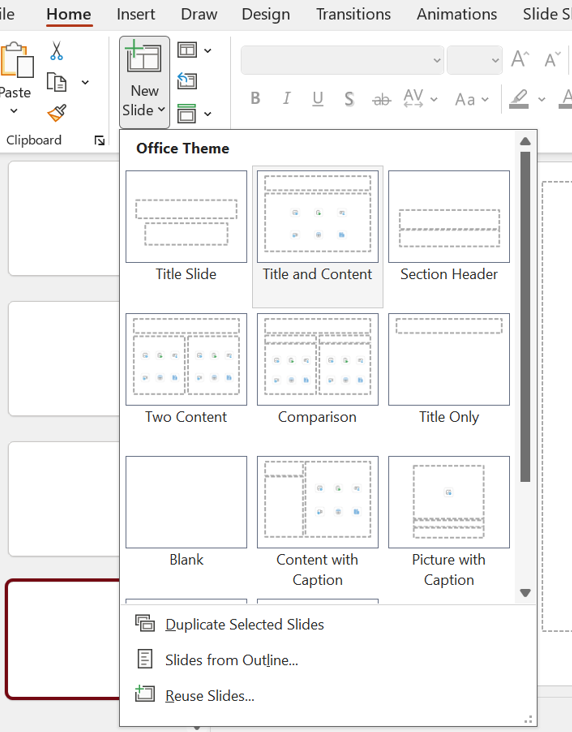

```py
lys = prs.slide_layouts[0]
lys = prs.slide_layouts[1]
lys = prs.slide_layouts[2]
```

### To dipslay all the layouts

```py
from pptx import Presentation

prs = Presentation()
lys = prs.slide_layouts[0]

for _ in lys:
    prs.slides.add_slide(_)

prs.save('./ppt_file/eg.pptx')
```

### Add title to slide

```py
from pptx import Presentation

prs = Presentation()

first = prs.slide_layouts[0]
slide = prs.slides.add_slide(first)

prs.save('./ppt_file/eg2.pptx')
```

### Hot to add title in slide

```py
from pptx import Presentation

prs = Presentation()

first = prs.slide_layouts[0]
slide = prs.slides.add_slide(first)

title = slide.shapes.title
title.text = "Hello world!!! 🐱‍🚀"
prs.save('./ppt_file/eg3.pptx')
```

> these boxes are placeholders

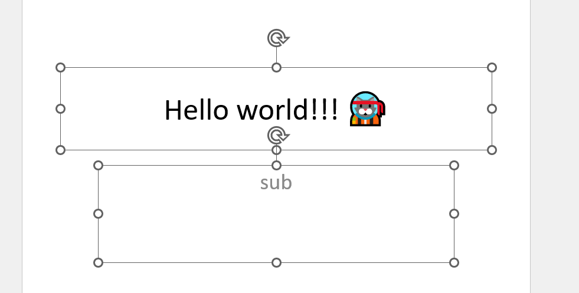

### placeholders eg

```py
from pptx import Presentation

prs = Presentation()

first = prs.slide_layouts[0]
slide = prs.slides.add_slide(first)

# set the title
title = slide.shapes.title
title.text = "Hello world!!! 🐱‍🚀"

# the place holders
subtitle  = slide.placeholders[1]
subtitle.text = "sub"
prs.save('./ppt_file/eg4.pptx')
```

## list of layout names

```py
for slide in prs.slide_layouts:
    print(slide.name)
prs.save('./ppt_file/eg5.pptx')
```

```
Title Slide
Title and Content
Section Header
Two Content
Comparison
Title Only
Blank
Content with Caption
Picture with Caption
Title and Vertical Text
Vertical Title and Text

```

> total 11 layouts are there

## lets add bullets point

```py
second = prs.slide_layouts[1]
slide_second = prs.slides.add_slide(second)

slide_second_title = slide_second.shapes.title
slide_second_title.text = "Going to add Bullets"

slide_second_body = slide_second.shapes.placeholders[1]

if slide_second_body.has_text_frame:
    tf = slide_second_body.text_frame
    tf.text = '23123213'
```

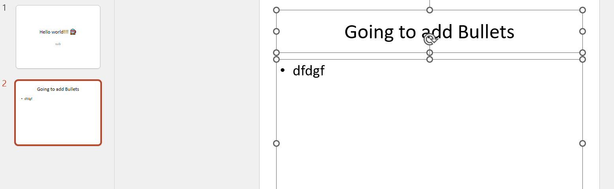

### add more Bullets points

```py
slide_second_title = slide_second.shapes.title
slide_second_title.text = "Going to add Bullets"

slide_second_body = slide_second.shapes.placeholders[1]

tf = slide_second_body.text_frame
tf.text = '23123213'

p = tf.add_paragraph()
p.text = "subdata"

p1 = tf.add_paragraph()
p1.text = "3"
```

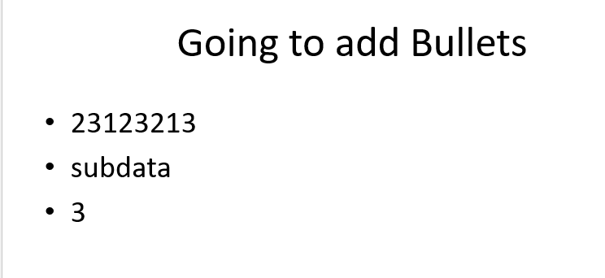

### add nested

```py

tf = slide_second_body.text_frame
tf.text = '23123213'

p = tf.add_paragraph()

p.text = "subdata"
p.level = 1
p1 = tf.add_paragraph()

p1.text = "3"
p1.level = 2
prs.save('./ppt_file/eg7.pptx')
```

has_text_frame can be used to determine whether a shape can contain text. (All shapes subclass _BaseShape.) When_BaseShape.has_text_frame is True,

_BaseShape.text and_TextFrame.text are provided to accomplish the same thing

### add_textbox()

add_textbox

- always require 4 paramters
add_textbox(
    left: Length,
    top: Length,
    width: Length,
    height: Length
) -> Shape

```py
from pptx import Presentation
from pptx.util import Inches, Pt

prs = Presentation()

# blank layout 7
blank_layout = prs.slide_layouts[6]
blank_slide = prs.slides.add_slide(blank_layout)

left = top = width = height = Inches(1)

txt_box = blank_slide.shapes.add_textbox(left,top,width,height)
txt_frm = txt_box.text_frame

txt_frm.text = "text box example"
```

### bold the text and incrase the size

```py

p = txt_frm.add_paragraph()
p.text = "This is a second paragraph that's bold"
p.font.bold = True

p = txt_frm.add_paragraph()
p.text = "This is a third paragraph that's big"
p.font.size = Pt(40)

prs.save("./ppt_file/eg8.pptx")
```

Output:

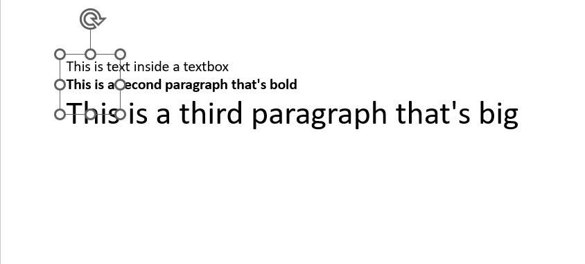

### change the text box posistion

```py

top = Inches(4)
left = width = height = Inches(1)

txt_box = blank_slide.shapes.add_textbox(left,top,width,height)
txt_frm = txt_box.text_frame
txt_frm.text = "text box example"

```

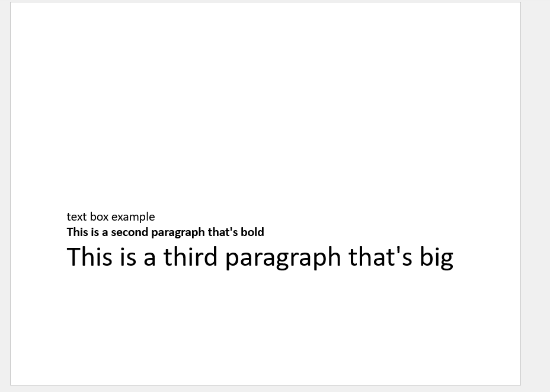

### Inches

- always require 1 arguments

```
class Inches(inches: float)
Convenience constructor for length in inches.
```

## add_picture()

Add picture shape displaying image in image_file.

image_file can be either a path to a file (a string) or a file-like object. The picture is positioned with its top-left corner at (top, left). If width and height are both |None|, the native size of the image is used

```py
from pptx import Presentation
from pptx.util import Inches, Pt

prs = Presentation()

# blank layout 7
blank_layout = prs.slide_layouts[6]
blank_slide = prs.slides.add_slide(blank_layout)

img_path = "./input/Animals in Love.jfif"

left = top = Inches(1) 
# it take 4 argument left and top are compulsory only 
# with and height are not
pic1 = blank_slide.shapes.add_picture(image_file=img_path,left=left,top=top,height=Inches(3))
pic2 = blank_slide.shapes.add_picture(image_file=img_path,left=Inches(5),top=top,height=Inches(3))

prs.save("./ppt_file/eg9.pptx")


```

Output


## add_shape()

5th layout which is title only
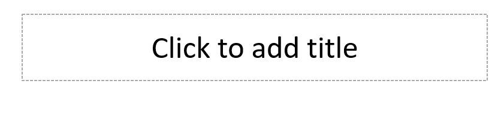

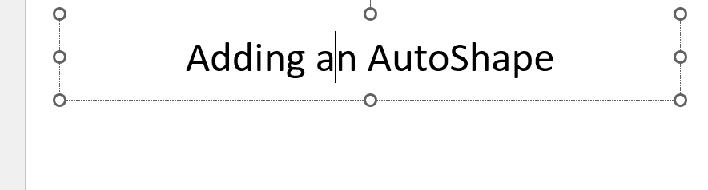

## center the shape

```py
left = Inches(0.93)  # 0.93" centers this overall set of shapes
top = Inches(3.0)
width = Inches(1.75)
height = Inches(1.0)

shape_Mso_sh = shapes.add_shape(MSO_SHAPE.PENTAGON, left, top, width, height)
prs.save("./ppt_file/eg10.pptx")
```

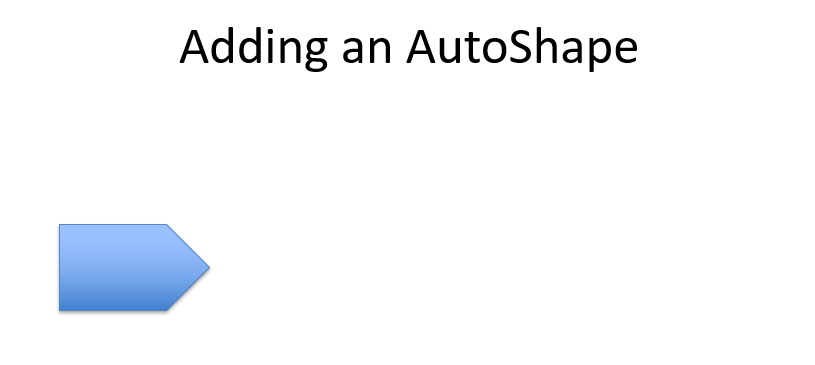

### all shape of MSO_SHAPE

```py

# center the shape
left = Inches(0.93)  # 0.93" centers this overall set of shapes
top = Inches(3.0)
width = Inches(2.75)
height = Inches(2.0)

for shape in MSO_SHAPE:
    slide = prs.slides.add_slide(title_layout)
    shapes = slide.shapes
    shapes.title.text = shape.name

    shape_Mso_sh = shapes.add_shape(shape, left, top, width, height)

prs.save(f"./ppt_file/MSO_SHAPE.pptx")
```

```py
# center the shape

left = Inches(0.93)  # 0.93" centers this overall set of shapes
top = Inches(3.0)
width = Inches(1.75)
height = Inches(1.0)

shape = shapes.add_shape(MSO_SHAPE.PENTAGON, left, top, width, height)
shape.text = 'Step 1'

left = left + width - Inches(0.4)
width = Inches(2.0)  # chevrons need more width for visual balance

for n in range(2, 6):
    shape = shapes.add_shape(MSO_SHAPE.CHEVRON, left, top, width, height)
    shape.text = f'Step {n}'
    shape.text = 'Step %d' % n

    left = left + width - Inches(0.4)


prs.save(f"./ppt_file/eg11.pptx")
```

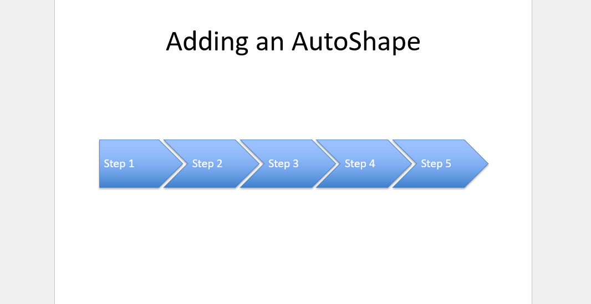

## add_table

The table has the specified number of rows and cols and the specified position and size. width is evenly distributed between the columns of the new table. Likewise, height is evenly distributed between the row

```py

rows = cols = 2
left = top = Inches(2.0)
width = Inches(6.0)
height = Inches(0.8)

table = shapes.add_table(rows, cols, left, top, width, height).table
# set column widths
table.columns[0].width = Inches(2.0)
table.columns[1].width = Inches(4.0)

# write column headings
table.cell(0, 0).text = 'Foo'
table.cell(0, 1).text = 'Bar'

# write body cells
table.cell(1, 0).text = 'Baz'
table.cell(1, 1).text = 'Qux'

prs.save(f"./ppt_file/eg12.pptx")
```

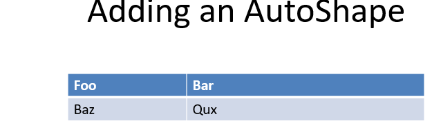

## Extract all text from slides in presentation¶

- text_runs will be populated with a list of strings,
- one for each text run in presentation
